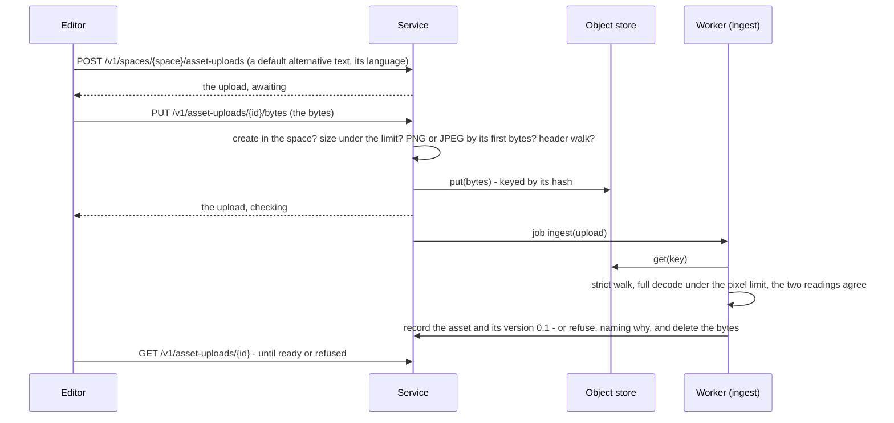

# Assets

An image an author puts into a component: how it arrives, what is proved about it before anything
may place it, where its bytes live, who may read it, and how the editor and the publisher reach it.

This realises the part of [AST](../specification/requirements/AST-assets-and-media.md) T1 needs for
figures and inline images. [content-model.md](content-model.md) already says what a component holds
of an image - an asset reference, an image style and an alternative text in three states - and left
ingest, and refusing an asset whose properties cannot be read, "to an assets design rather than to a
figure's reference". This is that design. It rests on
[storage-and-versioning.md](storage-and-versioning.md) (an asset versions through the one chain,
VER-011), [access.md](access.md) (who may read an artifact), [system.md](system.md) (the object
store, and heavy work in workers) and [publishing.md](publishing.md#figures), which says how a
figure reaches the PDF.

> **Built through the API** by [figures 1](../plans/2026-09-23-figures-01-assets.md): an image is
> uploaded into a space, checked in the service and in a worker's `ingest` job, stored by its hash and
> read back by who may read the space. [Figures 2](../plans/2026-09-23-figures-02-the-figure-in-the-editor.md) places it in the editor as a figure, and
> [`../architecture.md`](../architecture.md) describes it as it stands. **Ken's answer (2026-09-23):
> decisions F-A to F-P taken as recommended**, by merging this design and asking to continue.

## The shape in one paragraph

An upload is **checked twice**. The service reads what the bytes say they are - never the name or the
type a client claims - refuses anything but a PNG or a JPEG within the declared limits, keeps the
image alone - dropping whatever follows its end - and stores it in the tenant's store under its hash and records an **upload** in the state
`checking`. Nothing can place an upload that is checking. A worker's `ingest` job then proves the
file is what its format permits: a strict walk of its structure, which refuses stored bytes running
past the image's end, and a full decode under a pixel limit refuses a file that lies about its size
or does not decode. The two readings must agree on the dimensions. Only then is the upload recorded as
an **asset** - an artifact of its own kind, in a space, versioning through the chain - with its
intrinsic properties: its format, its dimensions **as it is displayed**, its colour space, the
resolution it declares if it declares one, and a default alternative text in a language, or none. A
refused upload's bytes are deleted and the refusal is kept, naming why. A figure references an
**asset version**, so a component version always shows the image it was saved with. The editor reads
an image through a service route that checks the reader may read it; the publisher copies each image
a document places into the compile root under its hash.

## Requirements owned

| ID          | How it is met                                                                                                                                                                                                                                                                                                                                                                                             |
| ----------- | --------------------------------------------------------------------------------------------------------------------------------------------------------------------------------------------------------------------------------------------------------------------------------------------------------------------------------------------------------------------------------------------------------- |
| **AST-001** | An upload is refused, `asset_format_not_permitted`, unless its bytes begin as a PNG or a JPEG does; the service refuses it before anything is stored                                                                                                                                                                                                                                                      |
| **AST-002** | The format is read from the file's first bytes - the PNG signature, the JPEG start-of-image marker - and the name and the claimed content type are never read                                                                                                                                                                                                                                             |
| **AST-038** | The one class T1 admits is **raster images**, declared as `ADMITTED_FORMATS` in `packages/domain`: PNG and JPEG. Any other file is refused rather than stored                                                                                                                                                                                                                                             |
| **AST-040** | The job decodes the whole file under a pixel limit, so a file whose header promises more than it holds, or whose decoded size exceeds the limit, is refused; the header walk refuses dimensions over the limit before the decoder runs. Neither admitted format nests, so there is no depth to bound                                                                                                      |
| **AST-041** | The store keeps the original under the SHA-256 of its bytes (`put` already chooses no other key), and that hash is what the asset version records and what a figure's bytes are fetched by                                                                                                                                                                                                                |
| **AST-005** | The asset version records format, dimensions as displayed, the EXIF orientation that turned them, colour space, bit depth, alpha, and the resolution the file declares, or none. Page count and duration do not apply to either admitted format                                                                                                                                                           |
| **AST-006** | The walk refuses, `malformed`, and the job, `undecodable`, a file whose dimensions or colour space cannot be read, whose two readings disagree, or that does not decode whole                                                                                                                                                                                                                             |
| **AST-051** | The two admitted formats are made safe by proof, as `ADMITTED_FORMATS` declares each: a strict walk of the structure, the image alone kept - whatever follows its end is dropped at the door - and a full decode under the pixel limit, whose dimensions must equal the walk's. No format that can carry active content a reader would act on is admitted, so none needs the scan AST-051 requires of one |
| **AST-035** | `checking` is the named state an upload waits in: its uploader alone sees it, it names no asset version, and nothing can place it until the job records one                                                                                                                                                                                                                                               |
| **AST-026** | An asset is in exactly one space - the space of the component it was uploaded into - and reading it is decided on the asset, like any artifact's                                                                                                                                                                                                                                                          |

AST-003 is superseded by AST-051 (decision F-A, issue #206), and AST-035 and AST-037 now speak of an
upload's **check** rather than its scan. AST-051 and AST-035 are claimed above. **AST-037 is not**:
a refused upload is recorded on its row, never deleted, and its bytes are removed, but AST-037 asks
for the refusal to be **audited**, and the audit log is LIF's and not designed - as access.md says of
its own, nothing here claims to be audited until it is.

**What a parse and a decode do not prove.** A PNG's text and private chunks, and a JPEG's comment
and application segments, can carry any bytes at all - a zip in a text chunk is still a well-formed
PNG, measured by the figures 1 review. They are inert here: the bytes are served only as the image's
own type, never sniffed and never run, and never offered for download. Removing what metadata carries
is AST-007's declared policy, which is T2's; until then the design claims no more than AST-051 says.

## What this document does not own

| What                                                                                     | Whose                                                                                                                                 |
| ---------------------------------------------------------------------------------------- | ------------------------------------------------------------------------------------------------------------------------------------- |
| Alternative text in three states, inherited, own or decorative                           | content-model.md (AST-012, AST-013, AST-015, AST-039). This design stores the default a figure inherits                               |
| How big a figure prints                                                                  | themes.md's image styles (STY-015 to STY-019). Until themes are built, the one default rule in [publishing.md](publishing.md#figures) |
| Refusing a figure with no alternative text at publish                                    | publishing.md (PUB-033, AST-014)                                                                                                      |
| Size limits a tenant can lower (AST-004), derivatives, licences, replacement             | T2 and T3. T1's limits are the product's, declared as constants                                                                       |
| An asset library, search over assets, where an asset is used (AST-018, AST-027, AST-028) | T2. In T1 an asset is reached only through the figure that places it                                                                  |
| Pasting or dropping an image into a component                                            | A later editor slice. Paste keeps no image today, and still will after these slices                                                   |

## Formats, measured

Every candidate compiled by the pinned Typst 0.15.1 with the worker's own flags - PDF/UA-1 and
`--features a11y-extras` - inside a figure with alternative text, checked by the pinned veraPDF, and
read by sharp 0.35.4 (libvips 8.18.6), the decoder decision F-D proposes. Throwaway files; nothing of
them is kept but this table.

| Format                                      | Typst                               | sharp                                             | For T1                                                   |
| ------------------------------------------- | ----------------------------------- | ------------------------------------------------- | -------------------------------------------------------- |
| PNG: RGB, alpha, palette, grey, 16-bit grey | Compiles, veraPDF 0 failed          | Reads and decodes each                            | **Admitted**                                             |
| JPEG: baseline, progressive, CMYK, grey     | Compiles, veraPDF 0 failed          | Reads and decodes each; reports CMYK as its space | **Admitted**                                             |
| GIF                                         | Compiles, first frame               | Reads                                             | Not admitted: animation means nothing on a page          |
| WebP                                        | Compiles                            | Reads                                             | Not admitted: Word's support is uneven, and Word is T1's |
| SVG                                         | Compiles; see below                 | Reads; 760 ms for one line of text                | **Not admitted in T1** - decision F-B                    |
| TIFF, BMP                                   | **Refused**: `unknown image format` | TIFF read, BMP refused                            | Not admitted                                             |

Four more things measured that the design depends on:

- **Typst applies EXIF orientation.** A JPEG stored 800 by 500 with orientation 6 measures 500 by 800
  in Typst, and sharp reports it as 800 by 500 with orientation 6. So an asset records its dimensions
  **as displayed** - swapped for orientations 5 to 8 - or every size worked out from them is wrong by
  a quarter turn.
- **Typst trusts an extension when there is one.** A JPEG named `.png` is refused (`Invalid PNG
signature`); the same bytes with no extension are sniffed and compile. So the publisher names each
  image in the compile root by its hash and **the extension its own bytes declared at ingest**.
- **A large JPEG costs nothing to publish.** A 6000 by 4000 JPEG compiled in 83 ms and was embedded
  as it came, 441 KB of PDF for 430 KB of JPEG. sharp decoded the same file whole in 42 ms. A palette
  PNG is re-encoded, 92 KB becoming 128 KB.
- **sharp does not see what follows an image.** A PNG with a script and a zip header appended after
  its end decodes cleanly - the polyglot a strict walk exists for. And sharp reports 72 dots per inch
  for a file that declares no resolution, so "declares none" cannot be read from it. Both are why
  `packages/domain` walks the structure itself (decision F-D).

### Why not SVG

An SVG is a document, not a picture. Measured: one linking an image by URL is refused by Typst, but
one linking `rgb.png` loads **whatever file of that name is in the compile root**; one carrying a
`<script>` and an `onload` handler compiles without a word. Neither matters in a PDF. Both matter the
moment the editor shows the file: an SVG served from the application's own origin and opened on its
own runs its script as the application. Admitting SVG needs a sanitiser, a policy for what it may link
and a way to serve it that cannot run as the product - and with them, the malware scan AST-003 asks
for, because an SVG can carry active content. That is a slice of its own, after T1's figures.

## The upload and the check

**The service's half is cheap and synchronous.** It decides `create` in the space (the component's,
passed by the editor), refuses a body over the byte limit before reading it whole, reads the first
bytes for the format, runs the header walk - which reads chunk and marker lengths and nothing
compressed - and refuses dimensions over the pixel limit. Everything it refuses is refused with
nothing stored.

**The worker's half is the expensive one**, which is why it is a job (system.md: anything heavy runs
in a worker). The job reads the object, walks it again - a job never trusts what a service decided -
decodes it whole under the pixel limit, and requires the decoder's dimensions and orientation to equal
the walk's. It then records, in one transaction, the asset artifact in the upload's space and its
version 0.1, and marks the upload `ready` naming it. A refusal marks the upload `refused` with the
reason, deletes the object, and keeps no bytes (AST-037's "without retaining the file", whichever way
F-A is answered).

**A refused upload is a finished job, never retried**, as a refused publish is: its own bytes caused
it. A job that fails for the store's or the database's reasons is retried as any job is.

| State      | Means                                                           | Can a figure place it? |
| ---------- | --------------------------------------------------------------- | ---------------------- |
| `checking` | Stored, its job not yet finished; visible to the uploader alone | No                     |
| `ready`    | An asset version exists, named by the upload                    | Yes, that version      |
| `refused`  | Refused, with its reason; its bytes deleted                     | No                     |

### The two readings

**The header walk** is a pure function in `packages/domain`, `readImageHeader(bytes)`, so it runs in
the service and the worker alike and is tested without either:

- **PNG**: the signature, then every chunk by its length and CRC, to `IEND`; `IHDR` for dimensions,
  bit depth and colour model; `pHYs` for resolution where its unit is the metre. A chunk whose CRC is
  wrong, a critical chunk the walk does not know, and `acTL` - an animated PNG, refused as GIF is -
  are refused. An ICC profile is not read: the colour recorded is the model, not the profile.
- **JPEG**: the markers from `SOI` to `SOS` by their lengths, then the entropy-coded data to `EOI`;
  `SOF0` to `SOF2` for dimensions and components - four components are CMYK; `APP0` (JFIF) for
  resolution, or `APP1` (EXIF) where JFIF declares none; `APP1` for orientation, read by its declared
  type and read as none where it is out of range, as the decoder reads it. Arithmetic coding and a
  lossless or hierarchical process are refused, since the decoders in the pipeline do not share them.
- **Where the image ends.** The walk reports it. The service keeps the bytes up to it and no further:
  a phone's Ultra HDR gain map or second picture, a motion clip, or a file hidden after the image is
  not the image, and a refusal of one would refuse most photographs a phone takes. The job refuses
  stored bytes that run past it, since by then they can only have been put there some other way.

**The decode** is sharp's, with `limitInputPixels` at the pixel limit and `failOn: 'error'`: a
truncated JPEG is refused, measured, and a 30000 by 30000 PNG of 109 KB is refused in a millisecond
without allocating anything.

### Limits

| Limit  | Value          | Why                                                                                                                           |
| ------ | -------------- | ----------------------------------------------------------------------------------------------------------------------------- |
| Bytes  | **25 MB**      | A high-quality 50-megapixel JPEG is under 20 MB; nothing larger is a picture for a report                                     |
| Pixels | **50 million** | Every phone and most cameras under it (a 6000 by 4000 photograph is 24 million); a decoded RGBA image of 50 million is 200 MB |

AST-004 asks for a limit per format that a tenant can lower. That is T2's, and these constants are
where it will read from.

## The asset, stored

An asset is an **artifact of kind `asset`**, in exactly one space, versioning through the chain as
every other kind does (VER-011): `artifact_kind_check` gains `asset`, and `artifact_space_by_kind`
puts it in a space. An **upload** is an operational row beside it, `asset_upload`, which names the
space, the uploader, the object key, the state and - once ready - the asset version, or - once refused

- the reason.

An asset version's content, at its schema version 1:

| Member            | Holds                                                                                                         |
| ----------------- | ------------------------------------------------------------------------------------------------------------- |
| `object`          | The object's key: its SHA-256, under the tenant's prefix                                                      |
| `format`          | `png` or `jpeg`                                                                                               |
| `bytes`           | The original's size                                                                                           |
| `width`, `height` | In pixels, **as displayed** - after the orientation below                                                     |
| `orientation`     | The EXIF orientation, 1 to 8; 1 where the file carries none                                                   |
| `colour`          | `rgb`, `grey` or `cmyk`; `alpha` true or false; `depth` 8 or 16                                               |
| `resolution`      | Dots per inch the file declares, or null where it declares none - never a guess                               |
| `alternative`     | The default alternative text and its BCP 47 language (AST-012, AST-039), or null where the uploader gave none |

**A figure references an asset version, not an asset.** A component version is immutable, and what it
shows must be too: a figure pinned to a version shows the same bytes with the same default text for as
long as the version exists. Floating at the latest version is AST-017's, and T2's. So the content
model's `asset` member, today any non-empty string, is tightened to an artifact version identifier -
**in place at content schema version 1**, as the table's shape was, because no figure has ever been
stored: a read-only count, run before the plan, is what licenses it (decision F-I).

**Changing the default alternative text is a new asset version** with the same object. A figure
pinned to the old version keeps the old default, which is AST-031's point - an asset version states
what it covers - reached without T2's per-property history.

## Reading an asset

**Who may read it** is decided on the asset, in its space, like any artifact (AST-026). The uploader
creates it in the space of the component they are editing, so everybody who may read that space may
read it. Somebody granted one component and not its space may not read an asset in it, and the editor
shows them a marker in its place: _An image you may not see_. That is the same rule a component
reference follows in an outline, and deliberately not a second rule for images.

**The bytes are served by the service**, not by a signed link to the store:

| Route                                   | Decided               | Answers                                                                                                                                                                                                                                                                    |
| --------------------------------------- | --------------------- | -------------------------------------------------------------------------------------------------------------------------------------------------------------------------------------------------------------------------------------------------------------------------- |
| `POST /v1/spaces/{space}/asset-uploads` | `create` in the space | The upload, `awaiting` its bytes, with the description it was given                                                                                                                                                                                                        |
| `PUT /v1/asset-uploads/{id}/bytes`      | The uploader alone    | The upload, `checking`. `413 asset_too_large` over the byte limit, read no further, which leaves it awaiting; `413 asset_too_large` over the pixel limit, `400 asset_format_not_permitted` and `400 asset_unreadable`, each of which refuses it; `409 asset_upload_filled` |
| `GET /v1/asset-uploads/{id}`            | The uploader alone    | The upload's state, and its asset version once ready or its reason once refused                                                                                                                                                                                            |
| `GET /v1/asset-versions/{id}`           | `read` on the asset   | The version's recorded properties                                                                                                                                                                                                                                          |
| `GET /v1/asset-versions/{id}/content`   | `read` on the asset   | The bytes, `Content-Type` from the recorded format, `X-Content-Type-Options: nosniff`, `Content-Security-Policy: sandbox`, and `Cache-Control: private, max-age=31536000, immutable` - a version's bytes never change                                                      |

A signed store link expires - five minutes for a download - and an editor stays open for hours, so an
image would break mid-session. A route on the application's origin also keeps the store's address out
of the renderer altogether.

## The publisher's half

`resolveOccurrences` already resolves every reference as the publisher. A figure adds one step: every
asset version the resolved components place is read **as the publisher**, and one they may not read
refuses the request by its place, as a component they may not read does. The job fetches each object,
checks its hash against its key before writing it - the same check the fonts get - and writes it into
the compile root as `assets/<hash>.<png|jpg>`. The published document names that path and nothing
else of the asset. The asset versions are recorded as `publication_input` rows beside the component
versions, so a publication names every image it printed.

## Requirements challenged

**AST-003 - "An upload must be scanned for malware before it can be referenced by anything."** Taken
as written, it puts a malware scanner in every deployment before the first figure. ClamAV is the only
open one worth considering, and its own documentation asks for **at least 3 GiB of memory, 4
preferred**, because loading the signature set alone takes 1.2 GiB and a reload briefly doubles it;
the image with its database is 456 MB, and keeping the signatures current needs the internet. For the
two formats T1 admits, a signature scan finds very little: the harm a PNG or a JPEG can carry is a
decoder exploit or a second file hidden after the image, and the strict walk and the full decode above
are aimed at exactly those - a byte after the image's end refused, a file that does not decode as
exactly one image refused.

**Recommendation: supersede AST-003** with a requirement that each admitted format declares how an
upload of it is made safe - **scanned, or proved by a strict parse and a full decode to hold nothing
but an image of that format** - and that a format able to carry active content (script, links,
embedded files: SVG, PDF, Office documents) must be scanned. T1 admits PNG and JPEG by proof; the
scanner arrives with the first format that needs one. AST-035 and AST-037 then read "awaiting its
check" and "fails its check", and this design claims all three. Decision F-A.

## Where the code lives

| Where                               | What                                                                                               |
| ----------------------------------- | -------------------------------------------------------------------------------------------------- |
| `domain: src/assets/`               | `ADMITTED_FORMATS`, the limits, `readImageHeader`, the asset version's stored shape and its parser |
| `db: migrations/tenant/0020_assets` | `asset` as a kind, `asset_upload`, and their grants and triggers                                   |
| `db: src/assets.ts`                 | Recording an upload, the ingest job's two outcomes, reading a version as a principal               |
| `api-contract: assets.ts`           | The five routes above                                                                              |
| `service: src/assets.ts`            | Their handlers, and the synchronous half of the check                                              |
| `worker: src/jobs/ingest.ts`        | The job: the walk again, sharp's decode, recording or refusing                                     |

## Decisions for Ken

| #   | Decision                                                                                                                                                                                      | Recommended                                                                                                        |
| --- | --------------------------------------------------------------------------------------------------------------------------------------------------------------------------------------------- | ------------------------------------------------------------------------------------------------------------------ |
| F-A | **AST-003 superseded**, as above: scanned or proved safe, by format; a format that can carry active content is scanned. No ClamAV in T1                                                       | Yes. The alternative is 3 to 4 GiB of memory in every deployment for a scan of two formats it can say little about |
| F-B | **PNG and JPEG only in T1.** SVG after T1, with a sanitiser, a policy for what it may link and a scan; GIF and WebP when a format needs them                                                  | Yes                                                                                                                |
| F-C | **Checked twice: the header in the service, the decode in a worker job**, with a `checking` state nothing can place                                                                           | Yes. Or everything in the service, at the cost of decoding 50 million pixels inside a request                      |
| F-D | **sharp 0.35.4 pinned in the worker** for the decode, and **our own header walk** in `packages/domain`, the two required to agree                                                             | Yes. sharp alone misses a polyglot and invents a resolution; our walk alone does not prove the file decodes        |
| F-E | **25 MB and 50 million pixels**, as product constants until AST-004                                                                                                                           | Yes                                                                                                                |
| F-F | **An asset is in the space of the component it was uploaded into**, read decided on the asset. AST-026, a T2 requirement, met early because the alternative is an asset nobody's grants reach | Yes                                                                                                                |
| F-G | **Bytes served by a service route**, with `nosniff`, a sandboxing policy and an immutable cache, not by signed store links                                                                    | Yes                                                                                                                |
| F-H | **A figure references an asset version**, pinned; floating at latest is T2's AST-017                                                                                                          | Yes                                                                                                                |
| F-I | **The content model's `asset` tightened in place** to an artifact version identifier, at schema version 1, on a read-only count of stored figures                                             | Yes, if the count is zero; a migration otherwise                                                                   |

## Changed while planning and building the first slice

| What                                                                                                                        | Why                                                                                                                                                                                                                        |
| --------------------------------------------------------------------------------------------------------------------------- | -------------------------------------------------------------------------------------------------------------------------------------------------------------------------------------------------------------------------- |
| **Two requests, not one**: an upload is made with its description, then filled with its bytes                               | The contract declares JSON bodies, and a description in a header or a query string is somewhere a log keeps it. The contract grew a raw body of one type for the second request (figures 1, R1 and R2)                     |
| **An upload is `awaiting` before it is `checking`**                                                                         | The first request makes it and the second fills it. A body over the byte limit is refused before it is read and leaves it awaiting; every other refusal at the door refuses it                                             |
| **`unchecked`**, a reason the design did not have                                                                           | A job that fails for the last time for the store's or the database's reasons - never the bytes' - must not leave an upload checking for ever, so its `failed` handler refuses it as unchecked                              |
| **The walk refuses too many pixels on the header alone**                                                                    | A bomb is refused by what its header claims, before anything after it is read                                                                                                                                              |
| **Changing a default description is not built**                                                                             | Nothing in these slices changes one, and the editor's panel does not (component-editor.md); the route waits for the asset library                                                                                          |
| **A PNG carrying an EXIF orientation is refused**                                                                           | Nobody has measured what the engine does with one, so an orientation that would turn the image is refused rather than guessed at                                                                                           |
| **The image alone is kept**, whatever follows its end dropped at the door (final review, 2 and 1)                           | Refusing bytes after the end refused most phone photographs - an Ultra HDR gain map or a camera's preview is a second JPEG after the first - and still let a file hide inside the image's own metadata, which is AST-007's |
| **AST-037 is not claimed**                                                                                                  | It asks for the refusal to be audited, and nothing audits one until LIF's log is designed (final review, 3)                                                                                                                |
| **Resolution is read from EXIF** where JFIF declares none; an out-of-range orientation reads as none                        | Phones and cameras write EXIF and no JFIF, and "declares none" in an immutable version must be true; the decoder sets such an orientation upright (final review, 4 and M10)                                                |
| **`create` is decided again when the bytes arrive**                                                                         | A grant removed since the upload was made must stop it, as every other creation is decided where it happens (final review, 6)                                                                                              |
| **Bytes are held by their hash** while they are stored or removed, and in use while any upload checking or ready names them | A refusal of one upload of an image must not remove what a second upload of it stands on (final review, 5)                                                                                                                 |
| **Anything but `application/octet-stream` is `415`**, and the upload still awaits                                           | A JSON or text body is not an image that failed its check, and must not burn the upload as one would (final review, M1)                                                                                                    |
| **A decoder's own failure is retried**, only the file's refused                                                             | Memory or a thread failing is not the author's image failing (final review, M4)                                                                                                                                            |
| **One upload per session is not built**                                                                                     | The editor, figures 2, uploads one at a time; nothing on the service limits it                                                                                                                                             |
