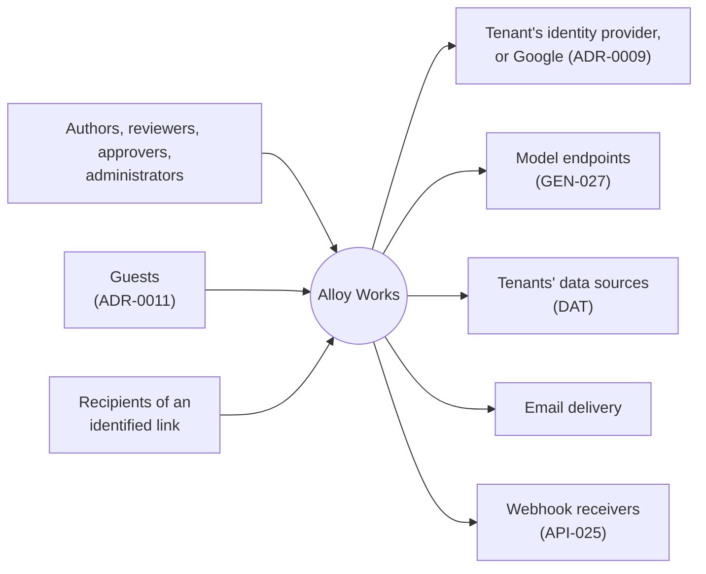
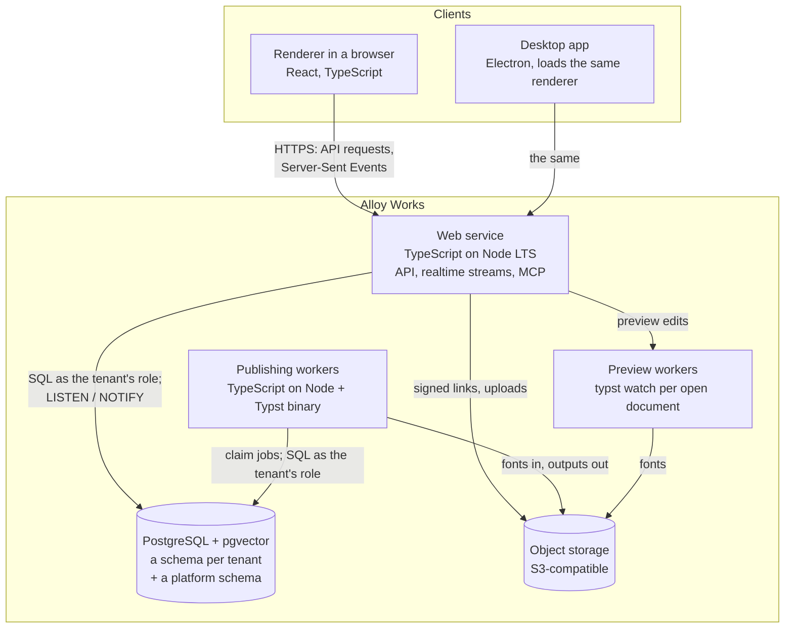
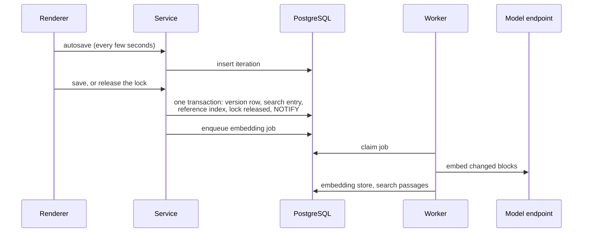

# System

The proposed system as a whole: what runs, in what, and how data moves between the pieces. It is
the map; the other documents in this folder are the depth, and each links from here.

> **Not true yet.** This describes the system being built towards. The repository as it stands -
> workspaces, the web and desktop split, the platform bridge, packaging - is described in
> [`../architecture.md`](../architecture.md), and [`../features.md`](../features.md) is the honest
> list of what exists. As containers are built, they move from here to there.

## The shape in one paragraph

A person works in the renderer - in a browser tab, or in the desktop app, which loads the same
renderer. The renderer talks to one web service, written in TypeScript on Node, which is the system
of record. The service keeps everything in PostgreSQL, one schema per tenant: content and its
history, search, relationships, presence and locks, and the fan-out that keeps screens live. Binary
files - assets, fonts, published outputs - are objects in S3-compatible storage. Anything heavy runs
in workers: publishing is a job claimed from a queue in Postgres, run through a pinned Typst binary
and our own Word writer, and previews are Typst kept warm per open document. The rules that matter -
what a component is, how a theme resolves, how Word is written - live once, in `packages/domain`,
and the renderer, the service and the workers all import them.

## Requirements owned

| ID          | How it is met                                                                                                                                  |
| ----------- | ---------------------------------------------------------------------------------------------------------------------------------------------- |
| **IAM-002** | Every container reaches tenant data only through that tenant's database role, scoped object-storage credentials and tenant channel - see below |

## Context

Who and what the system deals with.



## Containers



| Container          | Technology                                             | Does                                                                                                                     | Decided in                                                                                        |
| ------------------ | ------------------------------------------------------ | ------------------------------------------------------------------------------------------------------------------------ | ------------------------------------------------------------------------------------------------- |
| Renderer           | React, TypeScript, Vite (`apps/web`)                   | The whole interface, in both deliveries                                                                                  | [ADR-0003](../decisions/0003-one-renderer-two-deliveries.md)                                      |
| Desktop app        | Electron (`apps/desktop`)                              | Loads the renderer in a window; operating-system conveniences through the platform bridge                                | [ADR-0003](../decisions/0003-one-renderer-two-deliveries.md), scope §9 decision 2                 |
| Web service        | TypeScript on Node LTS                                 | The system of record: the API (OpenAPI), realtime streams, the MCP facade, sign-in, every permission decision            | [ADR-0019](../decisions/0019-platform-typescript-service-publishing-workers-object-storage.md)    |
| Publishing workers | TypeScript on Node, a pinned Typst binary              | Publishing jobs: resolve, project to Typst data and Word parts, render, store; other heavy or retried work as it arrives | [ADR-0013](../decisions/0013-typst-rendering-resolved-data-through-a-fixed-template.md), ADR-0019 |
| Preview workers    | The same image, running `typst watch`                  | One warm compilation per open document, so an edit reuses the layout that did not change                                 | ADR-0013, ADR-0019                                                                                |
| PostgreSQL         | PostgreSQL with pgvector                               | Everything but binaries: versions, search, relationships, presence, locks, the job queue, the realtime fan-out           | [ADR-0008](../decisions/0008-schema-per-tenant-isolation.md), 0012, 0016, 0017, 0018              |
| Object storage     | Any S3-compatible store; SeaweedFS in the compose file | Assets, pinned fonts, published PDF and Word files, keyed by content hash                                                | ADR-0019                                                                                          |

`packages/domain` is not a container but it is the reason there is one language: the content
schema, the theme resolver and the Word writer are imported by the renderer, the service and the
workers alike, so a rule cannot be implemented twice and drift.

## Data flows

### Signing in

The service redirects to the tenant's identity provider over OIDC, or to Google where the tenant has
none (ADR-0009), and holds no password of any kind. The session it issues names the principal and the
tenant; every request and every realtime stream after that is authorised against it (API-016).

### Authoring



Autosaves land in the iteration store, which nothing else reads (ADR-0006, ADR-0012). A version is
cut only on a positive act, and the transaction that cuts it also writes what must be true at once:
the words for search (ADR-0016), the references for "where is this used" (ADR-0017), the released
lock and its notification (ADR-0018). Embedding is a model call, so it follows as a job.

### Live updates

Each open document holds one Server-Sent Events stream to the service. Anything a person does is an
ordinary request whose transaction notifies Postgres; every service instance listens, and each sends
its own viewers what they may see, as ids. A connection starts with a snapshot, so a reconnect is a
connect. See [realtime.md](realtime.md).

### Search and traversal

A request computes the caller's permission set once, then runs one query in the tenant's schema -
words and meaning together for search, a de-duplicating recursive walk for relationships - with the
permission test inside it rather than applied to the results. See [search.md](search.md) and
[relationships.md](relationships.md).

### Publishing

```mermaid
sequenceDiagram
    participant R as Renderer
    participant S as Service
    participant D as PostgreSQL
    participant W as Publishing worker
    participant O as Object storage
    R->>S: publish
    S->>D: queue row: tenant, kind, ids
    W->>D: claim with SKIP LOCKED
    W->>D: resolve the document as the tenant's role
    W->>O: fetch the fonts the baseline pins
    W->>W: Typst: resolved JSON through the fixed template to PDF/UA
    W->>W: Word writer: the same resolved document to .docx
    W->>O: store the outputs by hash
    W->>D: publication record: versions, engine, template; notify
    S-->>R: inbox nudge on the stream
```

The resolved document is the one intermediate every output is made from (ADR-0013): Typst reads it
as data through one fixed template, and the Word writer reads the same thing (ADR-0015), both styled
by one resolved theme (ADR-0014, [themes.md](themes.md), [word-output.md](word-output.md)). Typst runs
with no network and only the fonts the baseline pins.

### Previewing

Opening a document's preview binds it to a preview worker running `typst watch` on that document's
data. Each saved change rewrites the data; Typst recompiles only what changed, and the pages come
back to the renderer. A preview is never a publication: it is untagged when it is a page range, and
nothing is recorded (PUB-061).

### Model output

A request for generation is answered with a stream: the service calls the tenant's model endpoint and
passes the output on as it arrives. Closing the request cancels the generation. Anything too long to
wait for becomes a job, and ends with a notification.

### Files

An upload is checked by its content, not its name (AST-002), stored as an object under its hash and
the tenant's prefix, and recorded as an asset version. Downloads are signed links the service issues
after checking permission, so the object store never decides who may read anything.

## Tenant isolation across the containers

ADR-0008 enforces isolation at the data layer. Across several containers that has to hold in each of
them, not only in the service (IAM-002):

| Where           | How                                                                                                                             |
| --------------- | ------------------------------------------------------------------------------------------------------------------------------- |
| PostgreSQL      | The service and workers act as the tenant's role, which can reach only that tenant's schema                                     |
| The job queue   | Rows in the platform schema carry a tenant, a kind and ids - never content; the worker assumes the tenant's role to do the work |
| Realtime        | A channel per tenant, carrying ids; each instance decides what each viewer hears                                                |
| Object storage  | Keys under the tenant's prefix, reached with credentials scoped to it; readers get signed links, never credentials              |
| Logs and traces | A tenant id for diagnosis, never content (ADM-022)                                                                              |

## The desktop app

The desktop app loads the same renderer and talks to the same service, so nothing about the system
changes with the delivery. What the platform bridge was built for - file access, credentials held by
the operating system - has less to do now that the service is the system of record; scope §9 decision
2 already notes that the bridge is re-examined when the service arrives.

## Deployment

**For development and small installations, one compose file**: the service, a worker (which also
serves previews), PostgreSQL with pgvector, and SeaweedFS as the object store. It is the same set of
containers as a large installation, fewer of each.

**Production hosting is not decided** - which cloud, and whether customers may host the system
themselves. It is open in scope §10, hinging on data residency (ADM-Q01). The containers above
constrain it only a little: a managed Postgres must offer pgvector, and the store must speak S3.

## Where each part is designed

| Part                                           | Design                                                                                         |
| ---------------------------------------------- | ---------------------------------------------------------------------------------------------- |
| Versions, baselines, derived data              | [storage-and-versioning.md](storage-and-versioning.md)                                         |
| Themes and their three projections             | [themes.md](themes.md)                                                                         |
| Word output                                    | [word-output.md](word-output.md)                                                               |
| Search                                         | [search.md](search.md)                                                                         |
| Relationships and traversal                    | [relationships.md](relationships.md)                                                           |
| Realtime                                       | [realtime.md](realtime.md)                                                                     |
| The content model and the editor               | Not yet designed; T1. The schema draft in `packages/domain/src/content/` is its starting point |
| Tenancy, identity and access                   | Not yet designed; T1                                                                           |
| Outlines, numbering and cross-references       | Not yet designed; T1                                                                           |
| The publishing pipeline - resolve and template | Not yet designed; T1. ADR-0013 and the publishing spike fix its shape                          |
| The API surface                                | Not yet designed; T1                                                                           |
| Data, collaboration, reuse, AI, interchange    | Later tranches, designed when their tranche arrives                                            |

## Open questions

| ID  | Question                                                                                                                              |
| --- | ------------------------------------------------------------------------------------------------------------------------------------- |
| New | Hosting and self-hosting, open in scope §10                                                                                           |
| New | How preview pages reach the renderer - rendered images, or the PDF's pages - which the publishing pipeline's design decides           |
| New | Which email delivery service. Only the inbox is designed; a provider needs choosing before notifications by email (COL-033) are built |
